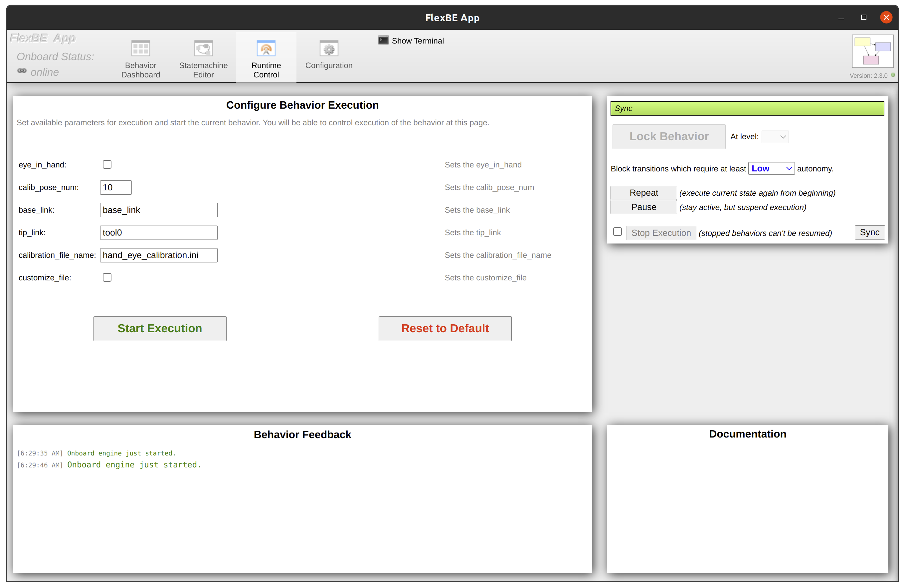

# Universal Automatical Hand-Eye-Calibration
This Hand-eye_calibration method include [FlexBE](http://philserver.bplaced.net/fbe/download.php), and [MoveIt!2](https://moveit.ros.org/), which make this whole framework easier for beginner to do hand-eye-calibration, also implement on different platform more faster.

## Acknowledgment
This charuco marker detection is forked from the [charuco_detector](https://github.com/carlosmccosta/charuco_detector).
And edit it to ROS2 version.

## Requirements 
This package requires a system setup with ROS. It is recommended to use **Ubuntu 22.04 with ROS
humble**.

camera SDK and ROS2 package is needed. Here we use [Linux Distribution](https://github.com/IntelRealSense/librealsense/blob/master/doc/distribution_linux.md#installing-the-packages) and [Realsense-ros](https://github.com/IntelRealSense/realsense-ros/tree/ros2-development)


To make sure that program isn't affected by python version, it is highly recommended to use a docker, 
we have build a environment that all Requirement for this package is build, 
See the [ubuntu-docker](https://github.com/errrr0501/ubuntu_docker) on information how to set this up.

## Building

```bash

# Install MoveIt 
sudo apt install ros-$ROS_DISTRO--moveit

# Clone this hand-eye-cliabtion package, flexbe_engine, flexbe_app, charuco_detector to your workspace
git clone --recursive https://github.com/tku-iarc/hand-eye-calibration_ROS2.git

# build the workspace
colcon build --symlink-install

# activate the workspace (ie: source it)
source install/setup.bash
```
## Alternative: Robot arm package
Note: MoveIt has been used on over 126 robots by the community, in this automatical hand-eye-calibration method, 
we chose it to do robot control and motion planning, therefore, user needs to use their own robot and it's MoveIt package.
For example, we use [Universal Robot 5 e-Series](https://github.com/UniversalRobots/Universal_Robots_ROS2_Driver/tree/humble) as sample.

## Setting up a robot for hand-eye-calibration

### Prepare the camera also do camera calibration first
Note:In our method we use Realsense camera model and do camera calibration with charuco marker board.
No matter what kind of calibration method just make sure you have Distortion parameter and Intrinsic parameter,
like we put in [directory](https://github.com/errrr0501/charuco_detector_ROS2/tree/main/charuco_detector/config/camera_calibration).
### Camera calibration
we call Realsense with python, calibrate with charuco marker board, and everything is under FlexBE.
If you want to use, call FlexBE:

```bash
ros2 launch flexbe_app flexbe_full.launch
```

Then, press `Load Behavior` on the top, and select `camera_calibration` in left window.

After this, you can press `Runtime Control` on the top, execution window will show:

<center></center>

Before press `Start Execution`, parameter `pic_num` decide how many calibration picture you will take, 
parameter `square_size`, `marker_size` , `col_count` , `row_count` means the spec of charuco marker board we use.
parameter `save_file_name` can let you change your result file name.

### Prepare the robot
Activate robot and open with MoveIt. 

As example using Universal Robot 5 e-Series:

- To start hardware, use:
```bash
ros2 launch ur_robot_driver ur_control.launch.py ur_type:=<UR_TYPE> robot_ip:=<IP_OF_THE_ROBOT> launch_rviz:=false
```
- To do test with moveIt, use:
```bash
ros2 launch ur_moveit_config ur_moveit.launch.py ur_type:=ur5e launch_rviz:=true

```

#### Quick start
### For using manual hand eye calibration
Note:Here we use Realsense D435i+UR5e, 
we use whole method with FlexBE and ROS2, open camera with ROS2 first:
- Open camera
```bash
cd ~/<your ros2_realsense workspace>
source install/setup.bash
ros2 launch realsense2_camera rs_launch.py rgb_camera.profile:=1920x1080x30 
```
WARN:Here use 1080p as camera resolution, because we use 1080p as camera calibration resolution,
if you want to change resolution, need to do camera calibration again with the resolution you change.

- Then launch flexbe_app flexbe_full.launch.
```bash
ros2 launch flexbe_app flexbe_full.launch
```
- Open charuco detector
```bash
ros2 launch charuco_detector hand_eye_calibration.launch.py
```
- Open visp_hand2eye_calibration server
```bash
ros2 run visp_hand2eye_calibration visp_hand2eye_calibration_calibrator
```
Note: In ros.yaml file we save in `charuco_detector/config/`
parameter `squaresSidesSizeM` is for for charuco board's squares side size, default is `0.0200`
parameter `markersSidesSizeM` is for for charuco board's markers side size, default is `0.0150`
parameter `numberOfBitsForMarkersSides` is for for charuco board's markers side size, default is `4`
parameter `numberOfMarkers` is for for charuco board's markers side size, default is `70`
parameter `numberOfSquaresInX` is for for charuco board's markers side size, default is `10`
parameter `numberOfSquaresInY` is for for charuco board's markers side size, default is `14`
parameter `dictionaryId` is for for charuco board's markers side size, default is `3`
parameter `image_topic` is for recieve camera image on ROS, default is `/camera/color/image_raw`
parameter `camera_info` is for recieve camera info on ROS, default is `/camera/color/camera_info`

Must colcon build --symlink-install after edit config file.

Then, press `Load Behavior` on the top, and select `Manual Hand Eye Calibration` in left window.

After this, you can press `Runtime Control` on the top, execution window will show:

<center></center>

Before press `Start Execution`, parameter `eye_in_hand` decide which calibration mode you want to use, 
`calib_pose_num` means how many sample points you want,
`base_link` , `tip_link` means the base coordinate and end-effector coordinate's name, 
`calibration_file_name` means the name of save file. `move_distance` means the distance of each sample points,
parameter `customize_file` , decide whether you want to change save file name or not.

## Result file

Result will save in `install/charuco_detector/share/charuco_detector/config/hand_eye_calibration/` .
